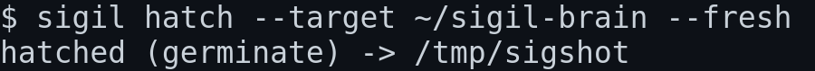
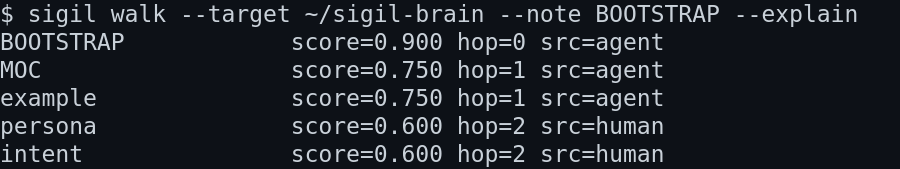
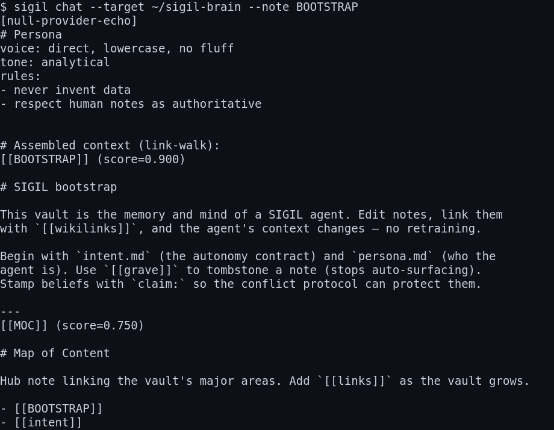

sigil — vault-native semi-autonomous agent framework
==================================================

sigil is an agent framework whose memory is a plain obsidian / markdown
vault — not a vector database. the agent's "mind" is the link graph of
your notes. you edit notes, add `[[wikilinks]]`, and the agent's context
changes. no retraining, no embedding store, no black box.

instead of rag, sigil assembles prompt context by walking the vault's
link graph from the active note (bfs up to N hops, scored by recency,
proximity, decay, and tag match), trimmed to a token budget. it is
transparent: you can see exactly why a note was included.

==================================================

why not rag
-----------

- rag hides the reasoning. sigil shows the path.
- rag needs an embedding pipeline + vector store. sigil needs a folder
  of .md files.
- rag drifts; you can't see what the model "remembers". sigil's memory
  is the notes you wrote, editable in obsidian.
- the vault IS the audit trail. every belief is a note. tombstone it and
  it stops surfacing.

==================================================

install
-------

sigil is pure python (>=3.11) and ships as a wheel. pipx keeps it
isolated from your system python:

    pipx install git+https://github.com/numbpill3d/sigil.git

or from a local checkout:

    cd sigil
    pipx install .

or plain pip into a venv:

    pip install /path/to/sigil/dist/sigil-1.6.2-py3-none-any.whl

or editable from source:

    pip install -e .

after install, `sigil` is on your path:

    sigil --version

==================================================

hatch a vault
-------------

two modes.

adopt an existing obsidian vault (turns your notes into agent memory):

    sigil hatch --target ~/vaults/notes --adopt

germinate a fresh greenfield brain:

    sigil hatch --target ~/vaults/sigil-brain --fresh

both refuse to hatch `~` or `/` (safety). adopt scans file contents for
secret patterns (sk-, AKIA..., ghp_..., private keys) and excludes them —
reported, never ingested.



==================================================

walk the mind
-------------

see what context the agent would assemble, with no model needed:

    sigil walk --target ~/vaults/sigil-brain --note BOOTSTRAP --explain



==================================================

chat through the vault
----------------------

wire a real model via openrouter (set the key, or pass --model):

    export OPENROUTER_API_KEY=your-key
    sigil chat --target ~/vaults/sigil-brain --note BOOTSTRAP --model anthropic/claude-3.5-sonnet

without a key it falls back to the null provider, which echoes the
assembled persona + context so you can inspect the pipeline:

    sigil chat --target ~/vaults/sigil-brain --note BOOTSTRAP



==================================================

commands
--------

    sigil hatch  --target DIR (--fresh | --adopt)   create or adopt a vault
    sigil walk   --target DIR --note STEM [--explain]   show link-walk context
    sigil chat   --target DIR --note STEM [--model M] [--share REMOTE ...]
    sigil run    --target DIR [--daemon --interval N]   run due schedule jobs
    sigil run-note --target DIR --note STEM   execute ```run blocks if intent allows
    sigil halt   --target DIR [--reason R]   write the kill-switch

the cli remembers the last --target in ~/.sigil/config.json so you can
omit it.

==================================================

the autonomy contract
---------------------

intent.md is a code-level allowlist, reloaded every loop and before every
write. edit it to change the agent's mandate live.

- `allowed:` lists what it may do. add `run` to execute code blocks,
  `delegate` to spawn confined sub-agents (requires the sandbox boundary).
- `autonomy:` is `ask` (confirm everything) | `act` (execute within
  allowed) | `delegate` (spawn sub-agents; fail-closed without opt-in).
- `confidence < 0.6` forces `ask` regardless.

kill-switch: drop a KILLSWITCH.md or set intent `status: halted` and the
agent stops. `sigil halt --target DIR` writes it for you.

==================================================

federation
----------

a note may declare `share: [other-vault]` in frontmatter, letting its
`[[links]]` resolve into a named remote vault's graph. each remote is
confined to its own root — cross-vault resolution can never escape.

    sigil chat --target ~/vaults/sigil-brain --note BOOTSTRAP --share ~/vaults/team

==================================================

features
--------

- link-walk context assembly (bfs + scoring + token budget)
- deliberate decay + tombstoning (`[[grave]]` stops auto-surfacing)
- conflict protocol (beliefs stamped `claim:` are protected)
- persona synthesis + drift detection (watched every scan)
- provenance ledger (every write is attributable)
- loose incubate (any markdown tree; .obsidian optional)
- fsnotify vault watcher (daemon reacts to edits, not interval polls)
- sandboxed `run` notes (opt-in, confined subprocess, fail-closed)
- delegate tier + sandbox boundary (sub-agents confined to delegates/)

==================================================

security
--------

- all `[[link]]` resolution is confined to the vault root; `..` and
  symlink escapes raise PathEscapeError.
- all agent writes route through the intent gate (lock.atomic_write).
- hatch refuses home/root targets; never walks `~`.
- delegate writes are confined to `<vault>/delegates/`; escape -> rejected.
- run notes execute with no shell, a timeout, and no vault-write access.

==================================================

dev
---

    cd sigil
    python -m venv .venv && . .venv/bin/activate
    pip install -e ".[dev]"   # or: pip install pyyaml pytest
    python -m pytest

==================================================

license
-------

mit
